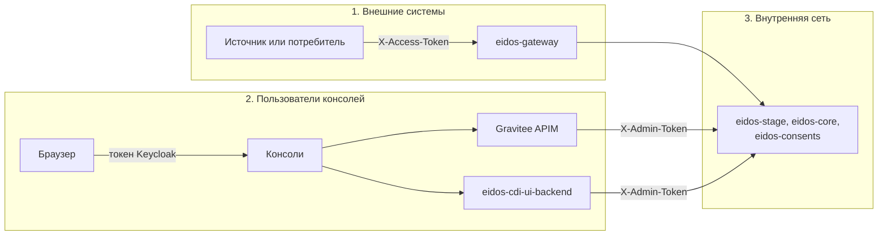

# Модель доступа

В платформе три независимых контура доступа: для внешних систем, для людей и
для сервисов между собой. У каждого свой способ подтверждения.

## Контур 1. Системы-источники и потребители

- Обращаются **только к `eidos-gateway`**.
- Предъявляют **токен источника** в заголовке `X-Access-Token` — в HTTP-запросе
  или в заголовке Kafka-сообщения.
- Шлюз находит источник по токену и подставляет его код в данные и в
  регистрируемые согласия. Служебные заголовки `X-Access-Token` и
  `X-Admin-Token` дальше шлюза не передаются.

Токен выдаётся администратором при регистрации источника. Один токен — один
источник; у потребителя, который только читает данные, тоже должен быть свой
«источник» в реестре.

Чего токен **не** ограничивает в текущей версии:

- любой действующий токен даёт доступ ко всем Золотым записям через внешний
  API поиска;
- в запросах на привязку внешних идентификаторов код источника берётся из тела
  запроса, а не из токена;
- отозвать согласие можно по его идентификатору, не будучи источником,
  который его зарегистрировал.

## Контур 2. Пользователи консолей

- Вход — через **Keycloak** (realm `eidos`, клиент `eidos-console`, OpenID
  Connect Authorization Code с PKCE). Своей формы входа у консолей нет.
- Консоль добавляет к каждому запросу токен Keycloak (`Authorization: Bearer`)
  и обновляет его сама.
- **Административные пути** — источники, контракты, каталог полей, Kafka,
  Золотые записи, конфликты — nginx консоли отправляет в **Gravitee APIM**.
  Gravitee проверяет подпись токена по ключам Keycloak и то, что токен выпущен
  для приложения `eidos-console`. Для запросов к `eidos-stage` и
  `eidos-gateway` Gravitee подставляет `X-Admin-Token`.
- **Остальные пути** — дашборд, аудит-лог, согласия — обслуживает
  `eidos-cdi-ui-backend`. Он проверяет подпись токена и требует роль `ADMIN`.

Роли:

| Роль | Где задаётся | Что даёт |
|---|---|---|
| `ADMIN` | Keycloak, роль realm `eidos` | Доступ ко всем функциям обеих консолей |

!!! warning "Роль проверяется не везде"
    Gravitee проверяет только подпись токена и приложение, но не роль. Любой
    пользователь realm `eidos` получает доступ к административным путям,
    которые идут через Gravitee, даже без роли `ADMIN`. Заводите в realm только
    тех пользователей, которым нужна полная административная роль.

## Контур 3. Сервисы между собой

| Сервис | Что защищено | Как |
|---|---|---|
| `eidos-stage` | `/internal/**` — реестр, контракты, каталог полей, статистика | Заголовок `X-Admin-Token` |
| `eidos-gateway` | `/internal/**` — настройки Kafka | Заголовок `X-Admin-Token` |
| `eidos-stage` | `/api/v1/client-data`, `/api/v1/legal-data` | Не защищены: доверяют шлюзу |
| `eidos-core` | Все API | Не защищены |
| `eidos-consents` | Все API | Не защищены |

Административный токен — один общий секрет (`ADMIN_TOKEN`), который знают
`eidos-stage`, `eidos-gateway`, `eidos-cdi-ui-backend` и Gravitee.

!!! danger "Внутренние API нельзя публиковать"
    Кто достучится до `eidos-core`, `eidos-consents` или до приёма
    `eidos-stage` напрямую, получит доступ к данным без всякой проверки —
    например, сможет отправить карточку от имени любого источника. Наружу
    публикуются только `eidos-gateway`, консоли и Keycloak. См.
    [Периметр и угрозы](../security/perimeter.md).

## Где что настраивается

| Что | Где |
|---|---|
| Токены источников | Реестр источников — [Регистрация источника](../sources/registration.md) |
| Пользователи и роли | Keycloak — [Keycloak](../operations/keycloak.md) |
| Проверка токенов для админ-путей | Gravitee — [Gravitee APIM](../operations/gravitee.md) |
| Административный токен | Переменная `ADMIN_TOKEN` — [Конфигурация и секреты](../operations/configuration.md) |
