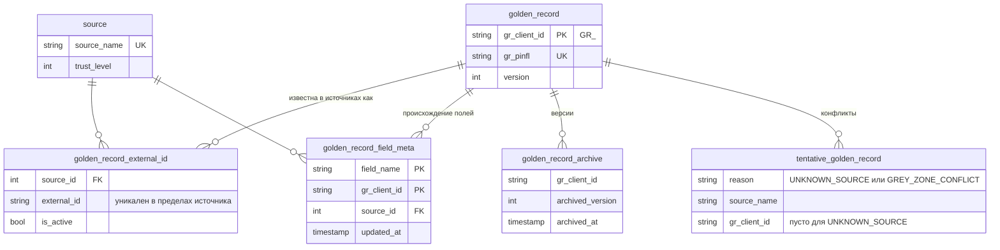

# Модель данных

## Два вида Золотых записей

| | Физическое лицо | Юридическое лицо (мерчант) |
|---|---|---|
| Таблица в `eidos_core` | `golden_record` | `legal_entity_record` |
| Идентификатор записи | `GR_<uuid>`, поле `grClientId` | `LE_<uuid>`, поле `grLegalEntityId` |
| Уникальный реквизит | ПИНФЛ (`GR_Pinfl`) | ИНН (`GR_Inn`) |
| Описание контракта | `GoldenRecordDto` | `LegalEntityGoldenRecordDto` |
| Полей | 42 | 60 (включая массивы телефонов и учредителей) |

Обе записи описаны в библиотеке `shared-library` — общем контракте данных,
который подключают все сервисы. Полный перечень полей с типами и проверками —
в справочнике: [физлицо](../reference/fields-person.md),
[юрлицо](../reference/fields-legal.md).

## Состав записи физлица

Поля сгруппированы так:

- **ФИО и личность** — фамилия, имя, отчество, пол, дата и место рождения;
- **гражданство и национальность** — значения и их коды в справочниках;
- **документ** — серия и номер паспорта, кем и когда выдан, срок действия;
- **ПИНФЛ**;
- **контакты** — основной мобильный телефон, e-mail;
- **адреса** — постоянный и временный адрес строкой, а также структурированные
  сведения о постоянной и временной регистрации: регион, район, махалля, адрес,
  кадастровый номер, даты.

Двенадцать полей обязательны: телефон, имя, фамилия, ПИНФЛ, пол, дата рождения,
гражданство и его код, паспорт, кем выдан и его код, дата выдачи. Карточка без
любого из них не попадёт в платформу. Три поля проверяются по формату:

| Поле | Формат |
|---|---|
| `GR_mobilePhoneMain` | `998` и ещё 9 цифр, например `998901234567` |
| `GR_Pinfl` | ровно 14 цифр |
| `GR_docPassData` | две заглавные латинские буквы и 7 цифр, например `AB1234567` |

Даты хранятся в формате `yyyy-MM-dd`, пол — `M` или `F`.

## Состав записи юрлица

- **идентификация** — ИНН (9 цифр), полное и краткое наименование;
- **организационно-правовая форма** — код и наименование на русском и
  узбекском;
- **регистрация** — дата, номер, орган, уставный фонд, признак малого бизнеса;
- **состояние** — код и наименование состояния деятельности, признаки
  «действует» и «банкрот»;
- **классификаторы** — ОКЭД, СООГУ, КФС, тип бизнеса;
- **адрес** — полный адрес, СОАТО, регион, район, населённый пункт, улица, дом,
  квартира, индекс;
- **контакты** — e-mail, его статус, массив телефонов;
- **руководство** — руководитель, массив учредителей с долями, число
  учредителей;
- **налоги и благонадёжность** — режим налогообложения, НДС, рейтинг и
  скоринг надёжности, признаки недобросовестности;
- **счётчики** — судебные дела, связи, лицензии, сделки, здания, кадастровые
  объекты.

Обязательны ИНН, полное наименование, признаки «действует» и «банкрот», код и
наименование ОКЭД.

!!! note "Структура учредителя предварительная"
    Элемент `GR_Founders` содержит `uuid`, `name`, `inn` (9 цифр),
    `pinfl` (14 цифр) и `sharePercent`. Состав подобран по типовому набору
    реестра и может быть уточнён по фактическим контрактам источников.

## Три формы имени поля

Одно и то же поле в разных местах называется по-разному. Это частый источник
ошибок при интеграции:

| Где | Форма | Пример |
|---|---|---|
| Дата-контракт: целевое поле | JSON-имя контракта | `GR_FirstName`, `GR_mobilePhoneMain` |
| Ответы API ядра (карточка, поиск) | Имя свойства | `grFirstName`, `grMobilePhoneMain` |
| Происхождение полей, конфликты | Имя свойства | `grFirstName` |
| База данных | Имя колонки | `gr_first_name` |

Правило перевода простое: префикс `GR_` превращается в `gr`, следующая буква
становится заглавной — `GR_docPassData` → `grDocPassData`.

## Служебные поля

У каждой Золотой записи есть:

- `version` — номер версии, начинается с 0 и растёт при каждом изменении
  данных слиянием или решением стюарда;
- `createdAt`, `updatedAt` — время создания и последнего изменения.

У записи физлица также есть служебные поля состояния согласия
(`pdConsentActive`, `pdConsentValidTo`, `pdConsentCheckedAt`) и слепого
индекса (`pdBiIdentity`, `pdBiIdentityDoc`, `pdBiPinfl`, `pdBiKeyVersion`).
Они меняются без изменения версии. См. [Согласия](consents.md) и
[Защита персональных данных](data-protection.md).

## Связанные сущности



- **Внешние идентификаторы** связывают запись с идентификатором клиента в
  каждой системе-источнике. Пара «источник + внешний идентификатор» уникальна.
- **Происхождение полей** — строка на каждое поле записи: какой источник дал
  текущее значение и когда.
- **Архив** — состояние записи после каждого изменения.
- **Незавершённые записи** — входящие данные, ожидающие решения стюарда.
- **Источники ядра** — таблица `source` с уровнями доверия; см.
  [Источники, доверие и контракты](sources-and-contracts.md).

У юрлиц те же сущности: `legal_entity_external_id`, `legal_entity_field_meta`,
`legal_entity_archive`, `tentative_legal_entity`.

## Каталог полей

Перечень полей не нужно переписывать вручную: библиотека строит его из
описания записи — имя, тип, обязательность, формат. Каталог отдаёт
`eidos-stage`:

```http
GET /internal/api/v1/golden-record-fields?entityType=PERSON
X-Admin-Token: …
```

```json
[
  {"jsonName": "GR_mobilePhoneMain", "javaName": "grMobilePhoneMain", "type": "STRING", "required": true, "pattern": "^998\\d{9}$"},
  {"jsonName": "GR_FirstName", "javaName": "grFirstName", "type": "STRING", "required": true, "pattern": null}
]
```

Из каталога строится список целевых полей в конструкторе контракта, и по нему
же `eidos-stage` проверяет, что правило контракта ссылается на существующее
поле. Как добавить поле в Золотую запись — см.
[Расширение платформы](../development/extending.md).
