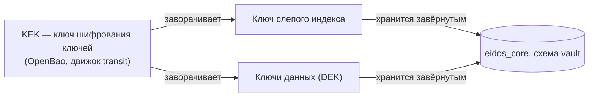

# Защита персональных данных

Платформа хранит персональные данные: ФИО, ПИНФЛ, паспорт, телефон, адреса.
Ядро содержит криптографический контур, который готовит платформу к хранению
этих данных в обезличенном виде. Часть контура уже работает, часть подготовлена
и ждёт подключения.

## Что действует, а что подготовлено

| Механизм | Состояние |
|---|---|
| Слепой индекс для сопоставления и поиска по ПИНФЛ | **Действует** для всех записей физлиц |
| Хранение ключей через OpenBao, ключ шифрования ключей не покидает хранилище | **Действует** — защищает ключ слепого индекса |
| Хранилище токенов и конвертное шифрование значений | **Подготовлено**: реализовано и покрыто тестами, к Золотой записи не подключено |
| Обезличивание записей клиентов без согласия | **Не реализовано**: ядро только записывает состояние согласия |

!!! warning "Значения хранятся в открытом виде"
    В текущей версии поля Золотой записи, сырьё в MongoDB и незавершённые
    записи хранят персональные данные открыто. Защищайте базы данных средствами
    инфраструктуры: шифрование дисков, сетевая изоляция, доступ по ролям. См.
    [Персональные данные](../security/personal-data.md).

## Слепой индекс

Слепой индекс — это HMAC-SHA256 от комбинации полей с секретным ключом. Он
позволяет проверять равенство, не сравнивая сами значения: одинаковые
комбинации дают одинаковый индекс, а восстановить значения по индексу без
ключа нельзя.

Ядро считает три индекса для каждой записи физлица:

| Индекс | Комбинация | Применение |
|---|---|---|
| `pd_bi_identity` | фамилия + имя + дата рождения + ПИНФЛ | Основное сопоставление, точный поиск по ПИНФЛ |
| `pd_bi_identity_doc` | фамилия + имя + дата рождения + паспорт | Запасное сопоставление, точный поиск по паспорту |
| `pd_bi_pinfl` | ПИНФЛ | Структурный поиск по ПИНФЛ |

Свойства:

- **Тот же результат, что прямое сравнение.** Значения берутся как есть, без
  нормализации, — правила сопоставления не меняются.
- **Индекс считается для всех записей** независимо от согласия, иначе поиск
  находил бы записи то с ним, то без него.
- **Пересчёт при каждом сохранении** записи.
- **Досчёт при старте.** Записи без индекса или с индексом от старого ключа
  ядро пересчитывает пачками при запуске. Досчёт идемпотентен и
  возобновляется после обрыва.
- **Ключ версионируется.** Номер версии ключа хранится рядом с индексом; этот
  же механизм пересчёта рассчитан на будущую ротацию ключа.

Следствие: ПИНФЛ в структурном поиске сопоставляется только целиком —
поиск по части номера невозможен.

## Ключи и OpenBao

Ключи устроены конвертно:

- **KEK** живёт в OpenBao и не покидает его. Ядро передаёт хранилищу ключ и
  получает его зашифрованным (`transit/encrypt`) или расшифрованным
  (`transit/decrypt`).
- **Ключ слепого индекса** генерируется ядром при первом обращении (Google
  Tink), заворачивается KEK и хранится в таблице `vault.pd_blind_index_key`.
  В памяти ядра ключ хранится в расшифрованном виде, пока работает процесс: так
  слепой индекс не требует обращения к хранилищу на каждую карточку.
- **При старте** ядро создаёт в OpenBao движок transit и KEK, если их нет.

!!! danger "Потеря KEK делает данные нечитаемыми"
    Без KEK ядро не расшифрует ключ слепого индекса: сопоставление и поиск
    перестанут работать. Когда подключат токенизацию, без KEK нельзя будет
    расшифровать и сами значения. Резервное копирование OpenBao так же важно,
    как резервное копирование базы. См. [OpenBao](../operations/openbao.md) и
    [Резервное копирование](../operations/backup.md).

## Хранилище токенов (подготовлено)

Для обезличивания в ядре есть хранилище токенов в схеме `vault`:

- на каждого клиента и прогон заводится ключ данных (DEK, AES-256-GCM),
  завёрнутый KEK (`vault.pd_dek`);
- значение поля шифруется ключом данных и заменяется непрозрачным токеном вида
  `tok_<32 hex>` (`vault.pd_token`);
- шифротекст привязан к клиенту и полю: перенести его на другое поле или
  другого клиента нельзя — расшифровка не пройдёт;
- раскрыть значение можно только через хранилище и только при доступном KEK.

Хранилище вынесено в отдельную схему, чтобы компрометация основной схемы сама по
себе не давала доступа к значениям. Слепой индекс позволит находить записи и
после замены значений токенами.

## Состояние согласия

Ядро записывает в Золотую запись, действует ли согласие на обработку
персональных данных — см. [Согласия](consents.md). Это опора для обезличивания:
следующий шаг — заменять значения токенами для клиентов без действующего
согласия и раскрывать их при новом согласии.
