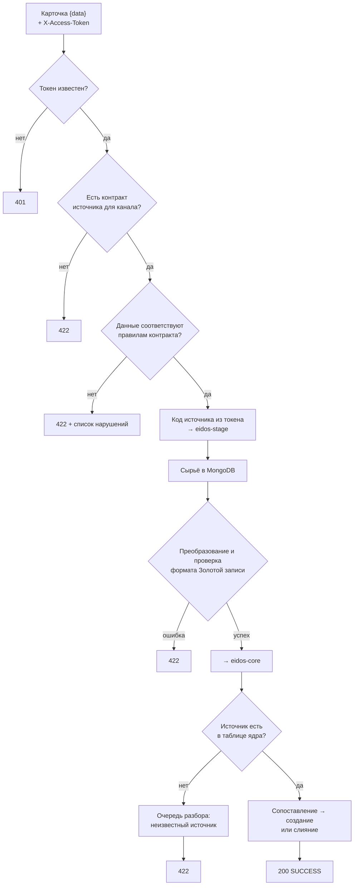

# Путь карточки через платформу

Карточка клиента проходит три сервиса: шлюз проверяет, кто её прислал и
соответствует ли она контракту, `eidos-stage` сохраняет сырьё и превращает
данные источника в Золотую запись, ядро находит или создаёт запись. По REST
весь путь проходит синхронно, и источник получает итоговый ответ.



## 1. Шлюз: кто прислал и по правилам ли

`eidos-gateway` принимает карточки физлиц на `POST /api/v1/client-data` и
юрлиц на `POST /api/v1/legal-data`. Тело — конверт с данными источника:

```json
{"data": { "...": "поля в формате источника" }}
```

Шлюз:

1. **Находит источник по токену** из заголовка `X-Access-Token`. Нет токена
   или он неизвестен — ответ `401`.
2. **Находит контракт** источника для типа сущности, который задан каналом.
   Контракта нет — `422`.
3. **Проверяет данные** против правил контракта: обязательность, таблицы
   значений, регулярные выражения, разбор дат, чисел и логических значений.
   Нарушения возвращаются списком — `422`.
4. **Проставляет код источника** в поле `source` конверта, заменяя то, что
   прислал источник, и передаёт карточку в `eidos-stage`.

Ответ `eidos-stage` шлюз возвращает источнику как есть.

## 2. eidos-stage: сырьё и преобразование

1. **Сохраняет сырьё.** Конверт записывается в MongoDB как есть — первым
   шагом, до любых преобразований. Даже если дальше обработка сорвётся,
   исходные данные останутся. Документ содержит код источника, тип сущности,
   данные и время получения.
2. **Находит контракт** по коду источника и типу сущности.
3. **Преобразует** данные: читает значения по путям, применяет таблицы
   значений, приводит даты к `yyyy-MM-dd`, переносит массивы и структуры
   целиком, подставляет значения по умолчанию. Идентификатор клиента в
   источнике берётся из поля-идентификатора контракта.
4. **Проверяет результат** по описанию Золотой записи: обязательные поля и
   форматы. Например, ПИНФЛ должен состоять из 14 цифр, даже если в контракте
   для него не задано регулярное выражение.
5. **Передаёт** Золотую запись, код источника и идентификатор клиента в
   источнике в ядро.

Любая ошибка на шагах 2–5 даёт ответ `422` с причиной в поле `detail`.

## 3. Ядро: найти или создать

`eidos-core` проверяет, что источник есть в его таблице источников.
Неизвестный источник — карточка уходит в очередь разбора с причиной
`UNKNOWN_SOURCE`, источнику возвращается ошибка. Иначе ядро ищет существующую
запись и создаёт новую или сливает данные с найденной — см.
[Сопоставление](matching.md) и [Слияние](merge.md).

## Канал Kafka

Через Kafka карточка проходит те же шаги, но без ответа отправителю:

- шлюз держит по одному потребителю на каждый настроенный топик; топик задаёт
  тип сущности;
- токен источника передаётся в заголовке сообщения `X-Access-Token`;
- после проверки шлюз отправляет карточку в `eidos-stage` тем же HTTP-вызовом,
  что и при REST;
- если сообщение отклонено на любом шаге, оно повторяется несколько раз, а
  затем пропускается с записью в журнал шлюза.

Подробности — [Передача через Kafka](../sources/kafka.md).

## Статистика приёма

Платформа ведёт по каждому источнику суточные счётчики принятых и отклонённых
карточек:

| Счётчик | Когда растёт |
|---|---|
| Принято | Ядро сохранило карточку (создание или слияние; в том числе когда слияние ничего не изменило) |
| Отклонено | Нет контракта или данные не прошли проверку на шлюзе; ошибка преобразования, проверки или ответ ядра с ошибкой в `eidos-stage` |

Статистика видна на дашборде консоли и в API `eidos-stage`
(`GET /internal/api/v1/ingest-stats`). Сутки считаются по часам сервера с
полуночи.

## Где что остаётся

| Исход | Сырьё в MongoDB | Золотая запись | Очередь разбора | Счётчик |
|---|---|---|---|---|
| Неверный токен | нет | нет | нет | — |
| Нарушение контракта на шлюзе | нет | нет | нет | отклонено |
| Ошибка в `eidos-stage` | да | нет | нет | отклонено |
| Источник неизвестен ядру | да | нет | да | отклонено |
| Конфликт при равном доверии | да | не меняется | да | принято |
| Создание или слияние | да | да | нет | принято |
