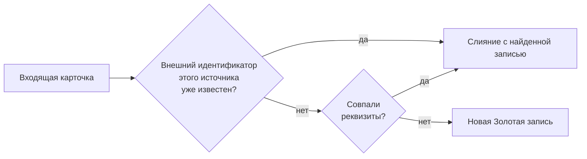

# Сопоставление

Сопоставление отвечает на вопрос: есть ли уже Золотая запись для клиента из
входящей карточки? Если есть — данные сливаются с ней, если нет — создаётся
новая запись.

## Порядок поиска

Ядро проверяет кандидатов по очереди и останавливается на первом найденном:

1. **По внешнему идентификатору.** Ядро ищет связку «источник +
   идентификатор клиента в источнике». Связка появляется, когда источник
   создаёт запись, или когда её привязывают через API. Если связка найдена,
   реквизиты карточки уже не сравниваются.
2. **По реквизитам** — правила зависят от вертикали.

## Физические лица

Ядро сравнивает две комбинации полей, по очереди:

| Шаг | Комбинация |
|---|---|
| Основная | фамилия + имя + дата рождения + ПИНФЛ |
| Запасная | фамилия + имя + дата рождения + серия и номер паспорта |

Сравнение **точное**: строки должны совпадать посимвольно, без приведения
регистра, без обрезки пробелов, без учёта транслитерации. «Каримов» и
«КАРИМОВ», «Алишер» и «Alisher» — разные значения. Сравнение идёт по слепому
индексу — хешу комбинации полей, — поэтому оно сохранит работоспособность после
токенизации значений. Результат такой же, как при прямом сравнении. См.
[Защита персональных данных](data-protection.md).

Что из этого следует для интеграции:

- **Нормализуйте данные в источнике** или средствами контракта (таблицы
  значений) так, чтобы ФИО у разных источников записывались одинаково.
  Иначе платформа заведёт для одного человека несколько записей.
- **Запасная комбинация** спасает, если ПИНФЛ различается, например из-за
  ошибки ввода, а паспорт тот же.
- **ПИНФЛ уникален.** Если ПИНФЛ совпал с существующей записью, а фамилия, имя
  или дата рождения отличаются, ни одна комбинация не совпадёт. Ядро попытается
  создать новую запись с тем же ПИНФЛ и получит отказ базы данных. Карточка
  будет отклонена с ошибкой, и в очередь разбора она не попадёт. Такие случаи
  видны в журнале ядра и в счётчике отклонённых.

## Юридические лица

Ключ один — **ИНН** (9 цифр). ИНН самодостаточен: карточка с известным ИНН
всегда сливается с существующей записью, даже если у мерчанта сменилось
название. ИНН в базе уникален.

## Нечёткий поиск — только для людей

Автоматическое сопоставление в платформе только точное. Нечёткий поиск
мерчантов по названию помогает человеку найти запись, но новые карточки по
нему не сопоставляются. См. [Поиск Золотой записи](../consumers/search.md).

## Если сопоставление ошиблось

| Ситуация | Что видно | Что делать |
|---|---|---|
| Один человек — две записи | Две записи с разными `GR_…` | Слить записи средствами платформы нельзя. Исправьте данные в источнике и уберите лишнюю запись на уровне базы данных по согласованию с владельцем данных |
| Карточка отклонена из-за совпадения ПИНФЛ | `422` от шлюза, в журнале ядра — нарушение уникальности `gr_pinfl` | Сверьте ФИО и дату рождения с существующей записью; исправьте данные в источнике |
| Источник сменил идентификатор клиента | Новая карточка сопоставилась по реквизитам, но поиск по новому идентификатору ничего не находит | Обновите связку через API — [Внешние идентификаторы](../consumers/external-ids.md) |
