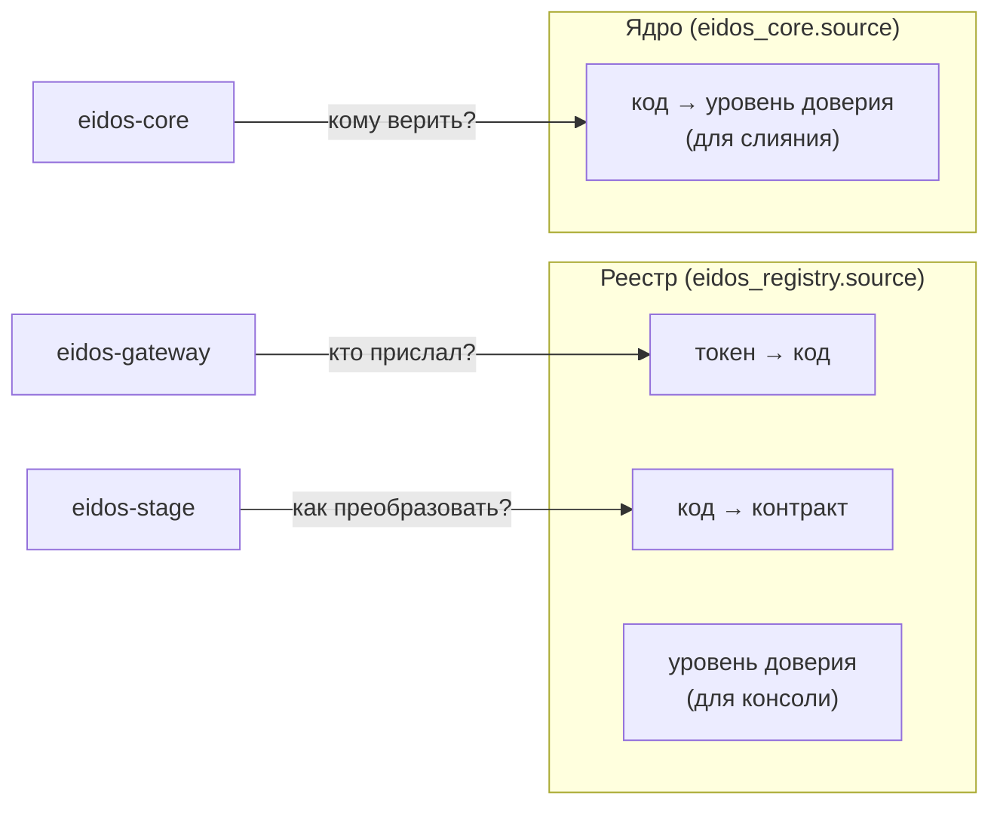

# Источники, доверие и контракты

## Источник

Источник — система, которая передаёт в платформу данные о клиентах. В реестре
у источника есть:

| Атрибут | Назначение |
|---|---|
| **Код** | Уникальный короткий идентификатор, например `bank-1`. Подставляется во все данные источника и служит его именем в ядре |
| **Название** | Человекочитаемое имя для консоли |
| **Токен доступа** | Секрет, по которому шлюз узнаёт источник. Уникален |
| **Уровень доверия** | Целое число; чем выше, тем приоритетнее значения источника при слиянии |
| **Признак «активен»** | Отображается в консоли; в текущей версии на приём не влияет |

Источник **не объявляет себя сам**. Шлюз находит источник по токену и сам
проставляет его код во всё, что источник прислал, — заменяя любое значение,
указанное в теле сообщения. Подделать чужое имя, зная только свой токен,
нельзя.

## Где хранятся источники

Сведения об источнике используются в трёх местах, и в текущей версии они
хранятся в двух таблицах:

- **Реестр** ведёт `eidos-stage`; его видят консоль и шлюз. Источник
  заводится в реестре через консоль или API.
- **Таблица источников ядра** определяет, какие источники ядро принимает и с
  каким уровнем доверия сливает их данные.

!!! warning "Таблицы не синхронизируются"
    Источник из реестра нужно отдельно добавить в таблицу ядра, а при смене
    уровня доверия — поменять его и там. Если источника нет в ядре, его данные
    отклоняются и попадают в очередь разбора как «неизвестный источник».
    Порядок действий — [Регистрация источника](../sources/registration.md).

## Уровень доверия

Уровень доверия — главный рычаг управления качеством Золотой записи. Правило
простое: значение из источника с **более высоким** уровнем заменяет значение
из источника с более низким; при **равных** уровнях расхождение уходит на
ручной разбор. Подробно — [Слияние и происхождение](merge.md).

Как выбирать уровни:

- **Ранжируйте источники по достоверности данных о личности.** Выше —
  системы, которые проверяют документы клиента: банковская система, системы с
  государственной идентификацией. Ниже — анкеты, партнёрские и маркетинговые
  источники.
- **Давайте источникам разные уровни**, если не хотите, чтобы их расхождения
  уходили людям на разбор. Равные уровни — осознанный выбор «пусть решает
  человек».
- **Оставляйте промежутки** (например, 2, 5, 8): новому источнику найдётся
  место без перенумерации.

Уровень доверия задаётся на источник целиком, а не на поле: источник,
которому верят в части телефона, получает тот же приоритет и для паспорта.

## Дата-контракт

Дата-контракт описывает, как данные конкретного источника превращаются в
Золотую запись. Контракт задаётся на пару **«источник + тип сущности»**: у
источника, который передаёт и физлиц, и мерчантов, два контракта.

Контракт состоит из:

- **поля-идентификатора** — пути к идентификатору клиента в данных источника
  (например, `client_id`). Значение становится внешним идентификатором
  Золотой записи;
- **правил полей** — по одному на каждое поле источника, которое попадает в
  Золотую запись.

Правило поля:

| Атрибут | Пример | Назначение |
|---|---|---|
| Поле источника | `person.birth_date` | Путь к значению в данных источника через точку |
| Целевое поле | `GR_BirthDate` | Поле Золотой записи |
| Тип | `DATE` | Как проверять и преобразовывать значение |
| Формат даты | `dd.MM.yyyy` | Как читать дату источника |
| Регулярное выражение | `^\d{14}$` | Проверка формата на входе |
| Таблица значений | `1→M, 2→F` | Перекодировка и одновременно список допустимых значений |
| Значение по умолчанию | `860` | Подставляется, если источник значение не прислал |
| Обязательность | да | Без значения карточка отклоняется |

Полная спецификация — [Формат дата-контракта](../reference/contract-format.md);
практическое руководство — [Дата-контракт](../sources/data-contract.md).

### Две ступени проверки

Данные проверяются дважды:

1. **На шлюзе — по правилам контракта**: обязательность, таблица значений,
   регулярное выражение, разбор даты, целого числа и логического значения.
   Нарушения возвращаются источнику списком.
2. **В `eidos-stage` — по описанию Золотой записи**: обязательные поля записи,
   форматы телефона, ПИНФЛ, паспорта, ИНН, длины строк.

Вторая ступень страхует от неполного контракта: если правило для обязательного
поля Золотой записи забыли, первая ступень пропустит карточку, а вторая
отклонит её. Поэтому контракт должен покрывать все обязательные поля целевой
записи.

### Версии контракта

Любое изменение контракта — поля-идентификатора или правила — увеличивает его
номер версии. Изменения действуют сразу для следующих сообщений. Предыдущие
версии не хранятся: номер версии показывает, что контракт менялся, но не
позволяет вернуться к прежнему состоянию. Перед заметной правкой сохраните
текущий контракт: `GET /internal/api/v1/sources/{id}/contract`.

## Тип сущности задаётся каналом

Физлица и юрлица приходят разными путями: свои REST-эндпоинты
(`/api/v1/client-data` и `/api/v1/legal-data`) и свои топики Kafka. Тип
определяется каналом, а не полем в сообщении. Источник не может отправить
мерчанта в вертикаль физлиц, а права и квоты на два потока можно настраивать
независимо.
