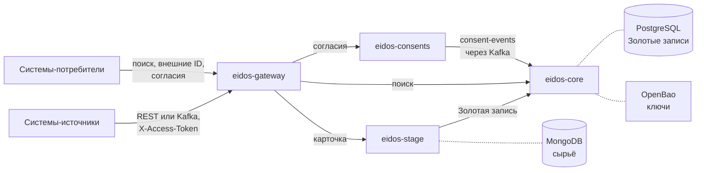
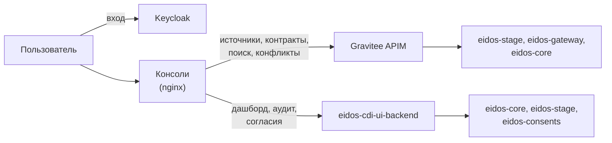
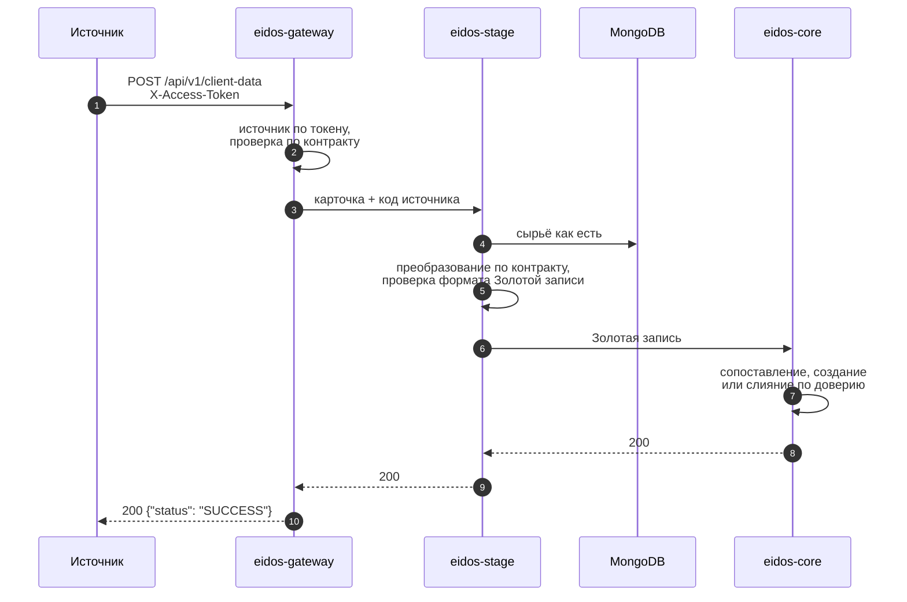

# Архитектура

Модуль состоит из пяти сервисов на Spring Boot, двух веб-консолей и общей
библиотеки контракта данных. Сервисы общаются по HTTP внутри сети развёртывания;
события о согласиях идут через Kafka.

## Компоненты и потоки данных

Данные от систем-источников проходят через три сервиса. Хранилища показаны
пунктиром:

Люди работают через консоли. Вход — через Keycloak; административные
операции идут через Gravitee APIM, остальные — через backend-for-frontend:

| Компонент | Назначение | Хранилище |
|---|---|---|
| **eidos-gateway** | Единственная точка входа для систем-источников и потребителей: авторизация по токену, проверка данных против дата-контракта, приём по REST и из Kafka, проксирование к ядру и сервису согласий | PostgreSQL `gateway` (настройки потребителей Kafka); реестр источников — только чтение |
| **eidos-stage** | Сохранение сырья, преобразование по дата-контракту, передача в ядро; реестр источников и контрактов; статистика приёма | MongoDB `eidos_stage`; PostgreSQL `eidos_registry` |
| **eidos-core** | Сопоставление, слияние, происхождение полей, версии и архив, очередь ручного разбора, поиск, состояние согласия на записи, слепой индекс | PostgreSQL `eidos_core` |
| **eidos-consents** | Согласия клиентов: хранение, проверка действия, отзыв, события | PostgreSQL `consents` |
| **eidos-cdi-ui-backend** | Backend-for-frontend консолей: сводный дашборд, журнал действий, согласия из карточки клиента | PostgreSQL `eidos_ui_backend` |
| **Консоли** | Консоль администратора и фронт-офис — одностраничные приложения за nginx | — |
| **shared-library** | Общий контракт данных: описание Золотых записей и каталог их полей | — |

Подробности о путях и портах — в разделе
[Порты и сетевые взаимодействия](../reference/ports.md).

## Путь карточки

Ответ приходит после того, как ядро сохранило запись: по REST источник
синхронно узнаёт результат обработки. Через Kafka тот же путь проходит без
ответа отправителю. Шаги подробно разобраны в разделе
[Путь карточки через платформу](../concepts/ingestion.md).

## Контуры доступа

В платформе три независимых контура доступа:

1. **Системы-источники и потребители** обращаются только к `eidos-gateway` и
   предъявляют токен источника в заголовке `X-Access-Token`.
2. **Пользователи консолей** входят через Keycloak (OpenID Connect,
   Authorization Code + PKCE). Запросы консоли несут токен Keycloak:
   административные пути проверяет Gravitee APIM, остальные — `eidos-cdi-ui-backend`.
3. **Сервисы между собой** работают во внутренней сети. Административные API
   `eidos-stage` и `eidos-gateway` закрыты общим токеном в заголовке
   `X-Admin-Token`. API `eidos-core` и `eidos-consents` собственной
   аутентификации не имеют и должны быть недоступны снаружи.

Подробнее — [Модель доступа](../concepts/access-model.md) и
[Периметр и угрозы](../security/perimeter.md).

## Развёртывание

Платформа поставляется как набор контейнеров и поднимается через Docker
Compose:

- `docker-compose.yml` в корне репозитория `eidos-infrastructure` — сервисы
  модуля и инфраструктура: PostgreSQL 16, MongoDB 7, Redpanda (Kafka API),
  Keycloak 26, OpenBao;
- `gravitee/docker-compose-apim.yml` — отдельный стек Gravitee APIM.

Контейнеры модуля работают в сети `eidos-net`. Сеть `frontend` связывает их со
стеком Gravitee. В текущей версии `docker-compose.yml` ожидает, что эта сеть
уже существует, а консоли маршрутизируют административные пути через Gravitee.
См. [Установка](../operations/install.md) и [Gravitee APIM](../operations/gravitee.md).

## Технологии

| Слой | Технологии |
|---|---|
| Сервисы | Java 26, Spring Boot 4, Spring Data JPA, Spring Kafka, Spring Security |
| Хранилища | PostgreSQL 16 (с расширением `pg_trgm`), MongoDB 7 |
| Обмен сообщениями | Kafka API (на стенде — Redpanda) |
| Криптография | Google Tink, OpenBao (движок transit) |
| Идентификация | Keycloak 26, OpenID Connect |
| API-шлюз для консолей | Gravitee APIM 4 (v4 PROXY API, JWT-план) |
| Консоли | React, TypeScript, Vite, keycloak-js, nginx |
| Миграции схемы | Flyway (`eidos-core`); остальные сервисы — Hibernate `ddl-auto=update` |
