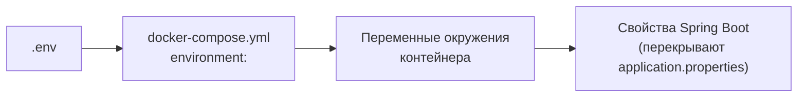

# Конфигурация и секреты

## Как устроена конфигурация

- У каждого сервиса есть `src/main/resources/application.properties` со
  значениями для локального запуска.
- В контейнере значения перекрываются переменными окружения. Имя переменной
  получается из имени свойства: точки и дефисы заменяются на `_`, буквы —
  заглавные. Например, `eidos.consents.events.expiry-cron` →
  `EIDOS_CONSENTS_EVENTS_EXPIRY_CRON`.
- `docker-compose.yml` задаёт переменные контейнеров; часть из них берёт
  значения из `.env`.

Любое свойство любого сервиса можно задать переменной окружения в
`docker-compose.yml` или в файле переопределений, без пересборки образа. Полный
перечень свойств — [Параметры конфигурации](../reference/configuration.md).

## Переменные `.env`

| Переменная | Значение по умолчанию в compose | Где используется | Назначение |
|---|---|---|---|
| `ADMIN_TOKEN` | `change-me-admin-token` | `eidos-stage`, `eidos-gateway`, `eidos-cdi-ui-backend`; скрипты `setup_gravitee.py`, `loadtest/setup.py` | Общий токен административных API (`X-Admin-Token`) |
| `POSTGRES_PASSWORD` | — | Не используется: пароль `postgres` записан в compose явно | Пароль PostgreSQL — см. [Стенд и продуктив](production.md#файл-переопределений) |
| `OPENBAO_TOKEN` | `eidos-dev-root-token` | `openbao` (корневой токен режима разработки), `eidos-core` | Доступ ядра к OpenBao |
| `OPENBAO_KEK_NAME` | `eidos-pd-kek` | `eidos-core` | Имя ключа шифрования ключей в transit |
| `CONSENT_EVENTS_TOPIC` | `consent-events` | `eidos-consents`, `eidos-core` | Топик событий о согласиях |
| `CONSENT_EXPIRY_CRON` | `0 5 0 * * *` | `eidos-consents` | Расписание прохода по истёкшим согласиям: секунды, минуты, часы, день, месяц, день недели |

!!! warning "Значения по умолчанию"
    Если переменная в `.env` пуста или не задана, compose подставит значение по
    умолчанию из таблицы. Для `ADMIN_TOKEN` и `OPENBAO_TOKEN` это известные
    строки из открытого репозитория — на сервере задайте их обязательно.

## Секреты платформы

| Секрет | Где хранится | Как сменить |
|---|---|---|
| Административный токен | `.env` → сервисы; политика Gravitee | `.env`, пересоздать сервисы, обновить Gravitee — см. [Gravitee APIM](gravitee.md#смена-административного-токена) |
| Токены источников | Реестр источников (`eidos_registry.source`) | Консоль или API — см. [Смена токена](../sources/registration.md#смена-токена) |
| Пароли PostgreSQL | Compose / файл переопределений | `ALTER USER`, затем переменные сервисов |
| Токен OpenBao | `.env` → `eidos-core` | Выпустить новый токен в OpenBao, обновить `.env`, пересоздать ядро |
| KEK | OpenBao | Ротация средствами transit — см. [OpenBao](openbao.md#ротация-kek) |
| Учётная запись администратора Keycloak | Переменные `KC_BOOTSTRAP_ADMIN_*` | Консоль Keycloak |
| Пароли пользователей консолей | Keycloak | Консоль Keycloak |
| Секрет клиента `eidos-m2m` | Realm Keycloak | Консоль Keycloak → Clients → Credentials |
| Учётная запись администратора Gravitee | Gravitee | Консоль Gravitee |

Файл `.env` не попадает в репозиторий (`.gitignore`). Ограничьте права на него
(`chmod 600 .env`) или передавайте секреты через механизм секретов вашей
инфраструктуры.

## Часто меняемые параметры

| Задача | Переменная | Сервис |
|---|---|---|
| Расписание прохода по истёкшим согласиям | `CONSENT_EXPIRY_CRON` в `.env` | `eidos-consents` |
| Отключить публикацию событий о согласиях | `EIDOS_CONSENTS_EVENTS_ENABLED=false` | `eidos-consents` |
| Отключить сверку согласий в ядре | `EIDOS_CONSENTS_EVENTS_ENABLED=false` | `eidos-core` |
| Группа потребителя событий в ядре | `EIDOS_CONSENTS_EVENTS_GROUP_ID` | `eidos-core` |
| Размер пачки досчёта слепого индекса | `EIDOS_CRYPTO_BLIND_INDEX_BATCH_SIZE` | `eidos-core` |
| Коллекция сырья | `EIDOS_STAGE_RAW_COLLECTION` | `eidos-stage` |
| Ключи Keycloak для проверки токенов | `SPRING_SECURITY_OAUTH2_RESOURCESERVER_JWT_JWK_SET_URI` | `eidos-cdi-ui-backend` |

Настройки потребителей Kafka шлюза хранятся не в конфигурации, а в базе шлюза
и меняются через консоль или API — см. [Передача через Kafka](../sources/kafka.md).

## Часовой пояс

Сервисы работают по часовому поясу контейнера — в образах по умолчанию UTC. От
него зависят «текущие сутки» в статистике приёма, «сегодня» при проверке
согласий и время ежедневного прохода по истёкшим согласиям. Чтобы считать по
местному времени, задайте переменную `TZ` (например, `TZ=Asia/Tashkent`) всем
сервисам модуля.
