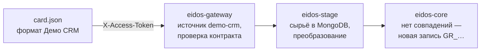

# Первая Золотая запись

В этом упражнении вы подключите учебный источник «Демо CRM», опишете его
дата-контракт, отправите карточку клиента и найдёте получившуюся Золотую запись
— через API и в консоли. Займёт около 15 минут.

Нужен поднятый [стенд](stand.md) и переменная `ADMIN_TOKEN` в терминале.

!!! info "Почему через API"
    Все шаги, кроме регистрации источника в ядре, можно выполнить и в консоли
    администратора — ссылки на соответствующие экраны даны по ходу. Команды
    `curl` удобнее повторять и не зависят от Gravitee.

## 1. Зарегистрируйте источник

Источник — это система, которая будет передавать данные. Заведите его в реестре
`eidos-stage`, придумав токен доступа:

```bash
export DEMO_CRM_TOKEN="tk_demo_crm_$(openssl rand -hex 16)"

curl -s -X POST http://localhost:8081/internal/api/v1/sources \
  -H "X-Admin-Token: $ADMIN_TOKEN" \
  -H "Content-Type: application/json" \
  -d "{\"code\":\"demo-crm\",\"name\":\"Демо CRM\",\"token\":\"$DEMO_CRM_TOKEN\",\"trustLevel\":5,\"enabled\":true}"
```

В ответе — карточка источника с числовым `id`. Сохраните его:

```bash
export DEMO_CRM_ID=<id из ответа>
```

То же можно сделать в консоли: **Источники → Новый источник**.

## 2. Зарегистрируйте источник в ядре

Ядро (`eidos-core`) держит собственную таблицу источников с уровнями доверия и
принимает данные только от источников из неё. В текущей версии эта таблица не
синхронизируется с реестром, поэтому источник добавляется SQL-командой. Имя в
ядре должно совпадать с **кодом** источника в реестре:

```bash
docker compose exec -T postgres psql -U postgres -d eidos_core -c \
  "INSERT INTO source (source_name, trust_level) VALUES ('demo-crm', 5)
   ON CONFLICT (source_name) DO UPDATE SET trust_level = EXCLUDED.trust_level;"
```

Ожидаемый ответ — `INSERT 0 1`. Подробнее о причинах —
[Регистрация источника](../sources/registration.md#регистрация-в-ядре).

## 3. Опишите дата-контракт

Демо CRM передаёт клиента в собственном формате: ФИО и дата рождения вложены в
объект `person`, даты записаны как `15.04.1990`, пол закодирован цифрой.
Дата-контракт говорит платформе, где лежит каждое значение и во что его
превратить.

Объявите в терминале две функции — они понадобятся и в следующем упражнении:

```bash
add_field() {  # $1 — id источника, $2 — описание поля в JSON
  curl -s -o /dev/null -w '%{http_code} ' -X POST \
    "http://localhost:8081/internal/api/v1/sources/$1/contract/fields?entityType=PERSON" \
    -H "X-Admin-Token: $ADMIN_TOKEN" -H "Content-Type: application/json" -d "$2"
}

person_contract() {  # $1 — id источника
  curl -s -o /dev/null -X PUT \
    "http://localhost:8081/internal/api/v1/sources/$1/contract?entityType=PERSON" \
    -H "X-Admin-Token: $ADMIN_TOKEN" -H "Content-Type: application/json" \
    -d '{"clientIdentifierField":"client_id"}'
  add_field "$1" '{"sourceFieldName":"person.last_name","targetGrField":"GR_LastName","dataType":"STRING","required":true}'
  add_field "$1" '{"sourceFieldName":"person.first_name","targetGrField":"GR_FirstName","dataType":"STRING","required":true}'
  add_field "$1" '{"sourceFieldName":"person.middle_name","targetGrField":"GR_MiddleName","dataType":"STRING"}'
  add_field "$1" '{"sourceFieldName":"person.birth_date","targetGrField":"GR_BirthDate","dataType":"DATE","required":true,"sourceDateFormat":"dd.MM.yyyy"}'
  add_field "$1" '{"sourceFieldName":"person.gender","targetGrField":"GR_Gender","dataType":"GENDER","required":true,"valueMap":{"1":"M","2":"F"}}'
  add_field "$1" '{"sourceFieldName":"person.pinfl","targetGrField":"GR_Pinfl","dataType":"STRING","required":true,"validationRegex":"^\\d{14}$"}'
  add_field "$1" '{"sourceFieldName":"phone","targetGrField":"GR_mobilePhoneMain","dataType":"STRING","required":true,"validationRegex":"^998\\d{9}$"}'
  add_field "$1" '{"sourceFieldName":"email","targetGrField":"GR_contactsEmail","dataType":"STRING"}'
  add_field "$1" '{"sourceFieldName":"citizenship.name","targetGrField":"GR_Citizenship","dataType":"STRING","required":true}'
  add_field "$1" '{"sourceFieldName":"citizenship.code","targetGrField":"GR_CitizenshipId","dataType":"STRING","required":true}'
  add_field "$1" '{"sourceFieldName":"passport.number","targetGrField":"GR_docPassData","dataType":"STRING","required":true,"validationRegex":"^[A-Z]{2}\\d{7}$"}'
  add_field "$1" '{"sourceFieldName":"passport.issued_by","targetGrField":"GR_docIssuedBy","dataType":"STRING","required":true}'
  add_field "$1" '{"sourceFieldName":"passport.issued_by_id","targetGrField":"GR_docIssuedById","dataType":"STRING","required":true}'
  add_field "$1" '{"sourceFieldName":"passport.issued_date","targetGrField":"GR_docIssuedDate","dataType":"DATE","required":true,"sourceDateFormat":"dd.MM.yyyy"}'
  echo
}
```

Создайте контракт:

```bash
person_contract "$DEMO_CRM_ID"
```

Каждое поле должно вернуть `201`. Контракт покрывает все обязательные поля
Золотой записи физлица — без них карточка будет отклонена. Откройте в консоли
**Конструктор контракта**, выберите `demo-crm` и тип «Физлица»: там видны все
14 правил.

Что означают атрибуты полей, описано в разделе
[Дата-контракт](../sources/data-contract.md).

## 4. Отправьте карточку клиента

Сохраните карточку в формате Демо CRM. Данные источника передаются в поле
`data`; код источника указывать не нужно — платформа возьмёт его из токена.

```bash
cat > card.json <<'EOF'
{
  "data": {
    "client_id": "CRM-000123",
    "person": {
      "last_name": "Каримов",
      "first_name": "Алишер",
      "middle_name": "Бахтиёрович",
      "birth_date": "15.04.1990",
      "gender": "1",
      "pinfl": "31504900120034"
    },
    "phone": "998901234567",
    "email": "a.karimov@example.uz",
    "citizenship": { "name": "Узбекистан", "code": "860" },
    "passport": {
      "number": "AB1234567",
      "issued_by": "ОВД Мирзо-Улугбекского района",
      "issued_by_id": "26283",
      "issued_date": "20.05.2015"
    }
  }
}
EOF
```

Отправьте её в шлюз:

```bash
curl -s -X POST http://localhost:8090/api/v1/client-data \
  -H "X-Access-Token: $DEMO_CRM_TOKEN" \
  -H "Content-Type: application/json" \
  --data-binary @card.json
```

Ответ `{"status":"SUCCESS"}` означает, что карточка прошла весь путь: шлюз
проверил её по контракту, `eidos-stage` сохранил сырьё и преобразовал данные,
`eidos-core` создал Золотую запись.

## 5. Найдите Золотую запись

Найдите запись по идентификатору клиента в Демо CRM — так её будет искать сама
система-источник:

```bash
curl -s "http://localhost:8090/api/v1/external/golden-records/search/source-id?source=demo-crm&source_id=CRM-000123" \
  -H "X-Access-Token: $DEMO_CRM_TOKEN"
```

Ответ (сокращён):

```json
{
  "grClientId": "GR_5f0c2b1e-8a4d-4c55-9a8e-2b7d4f1c9e10",
  "version": 0,
  "grLastName": "Каримов",
  "grFirstName": "Алишер",
  "grBirthDate": "1990-04-15",
  "grGender": "M",
  "grPinfl": "31504900120034",
  "grMobilePhoneMain": "998901234567",
  "grDocPassData": "AB1234567",
  "…": "…"
}
```

Обратите внимание: дата приведена к формату `yyyy-MM-dd`, пол — к `M`. Сохраните
идентификатор записи:

```bash
export GR_ID=<grClientId из ответа>
```

В консоли администратора откройте **Поиск Golden Records**, введите ПИНФЛ
`31504900120034` и откройте карточку.

## 6. Посмотрите происхождение полей

```bash
curl -s "http://localhost:8080/api/v1/internal/golden-records/$GR_ID/field-meta"
```

Для каждого поля Золотой записи — в том числе пустого — ответ показывает
источник и его уровень доверия. Сейчас везде `demo-crm` и `5`. Фрагмент ответа:

```json
[
  {"fieldName": "grContactsEmail", "sourceName": "demo-crm", "trustLevel": 5, "updatedAt": "2026-10-04T10:15:30.481"},
  {"fieldName": "grFirstName", "sourceName": "demo-crm", "trustLevel": 5, "updatedAt": "2026-10-04T10:15:30.481"}
]
```

В карточке клиента в консоли это панель «Происхождение полей».

## 7. Проверьте защиту от неверных данных

Испортите телефон и отправьте карточку ещё раз:

```bash
sed 's/"998901234567"/"8901234567"/' card.json > bad-card.json
curl -s -X POST http://localhost:8090/api/v1/client-data \
  -H "X-Access-Token: $DEMO_CRM_TOKEN" -H "Content-Type: application/json" \
  --data-binary @bad-card.json
```

Шлюз отклонит карточку ещё до платформы — ответ `422`:

```json
{"detail":"Client data failed contract validation: field 'phone' does not match required format"}
```

Отклонение попадёт в статистику приёма — она видна на дашборде консоли.

## Что произошло



Подробно о каждом шаге — [Путь карточки через платформу](../concepts/ingestion.md).

## Дальше

[Слияние и конфликт](merge-and-conflict.md) — подключите второй и третий
источники и посмотрите, как платформа сливает данные по уровню доверия.
