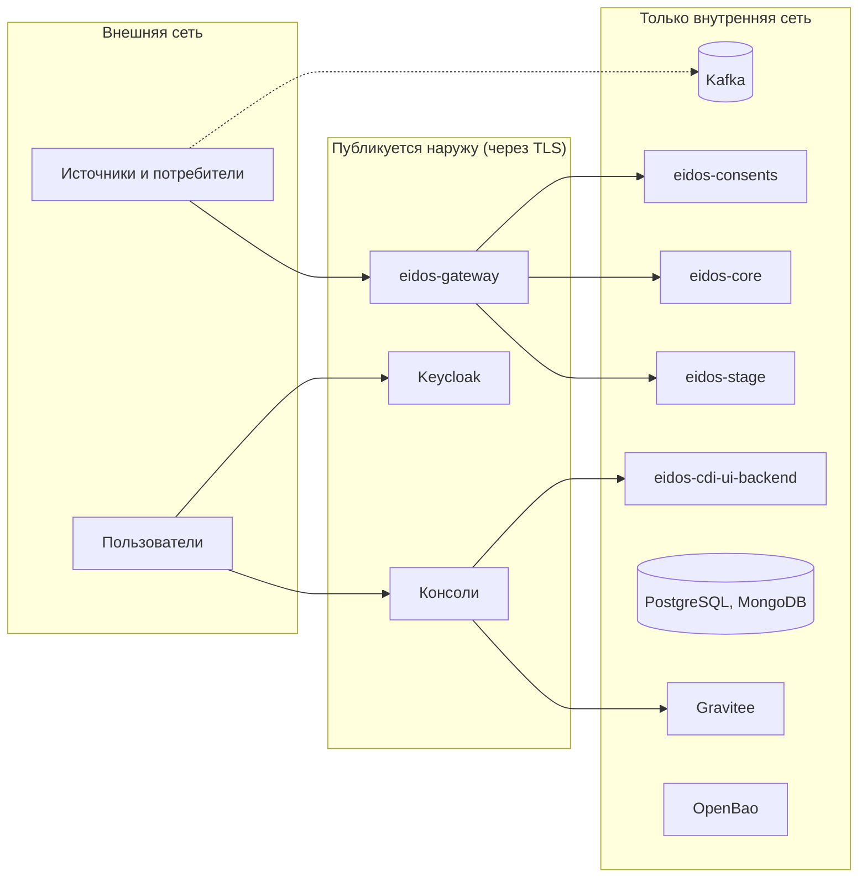

# Периметр и угрозы

## Что защищаем

| Актив | Где | Последствия компрометации |
|---|---|---|
| Персональные данные клиентов | PostgreSQL `eidos_core`, MongoDB `eidos_stage`, журналы, выгрузки из консолей | Утечка ПД, нарушение законодательства о персональных данных |
| Согласия клиентов | PostgreSQL `consents` | Обработка данных без законного основания |
| Токены источников | Реестр `eidos_registry`, консоль | Запись данных от имени источника, чтение всех Золотых записей |
| Административный токен | `.env`, сервисы, Gravitee | Полный контроль над реестром, контрактами и Kafka |
| KEK | OpenBao | Раскрытие ключей слепого индекса и хранилища токенов; при утрате — потеря сопоставления |
| Учётные записи консолей | Keycloak | Доступ ко всем функциям консолей |

## Границы доверия

| Компонент | Аутентификация на входе | Публиковать наружу |
|---|---|---|
| `eidos-gateway`, внешний API | Токен источника | Да, через TLS |
| `eidos-gateway`, `/internal/**` | `X-Admin-Token` | Нет — закройте путь на обратном прокси |
| Консоли (nginx) | Вход через Keycloak | Да, через TLS |
| Keycloak | Собственная | Да, через TLS; консоль администрирования — по возможности только изнутри |
| Gravitee APIM | Токен Keycloak (JWT) | Нет |
| `eidos-stage` | `X-Admin-Token` только на `/internal/**`; приём — **без аутентификации** | Нет |
| `eidos-core` | **Нет** | Нет |
| `eidos-consents` | **Нет** | Нет |
| `eidos-cdi-ui-backend` | Токен Keycloak, роль `ADMIN` | Нет — доступен через nginx консолей |
| PostgreSQL, MongoDB, Kafka, OpenBao | Собственная (на стенде — отключена или по умолчанию) | Нет |

## Угрозы и меры

| Угроза | Мера в платформе | Что сделать при установке |
|---|---|---|
| Источник выдаёт себя за другой | Код источника берётся из токена, а не из данных | Уникальные стойкие токены, передача по защищённому каналу, смена при утечке |
| Обход шлюза: прямая запись в `eidos-stage` или `eidos-core` от имени любого источника | Нет | Сетевая изоляция: сервисы недоступны извне и из сетей источников |
| Перехват трафика | Нет | TLS на обратном прокси; внутренняя сеть изолирована |
| Чтение чужих данных через внешний API | Нет разграничения по источникам: любой токен даёт поиск по всем записям | Выдавайте токены только доверенным системам; учитывайте это в договорах с партнёрами |
| Подмена внешних идентификаторов другого источника | Нет: код источника берётся из тела запроса | Ограничьте круг систем с доступом к внешнему API |
| Отзыв чужого согласия по идентификатору | Нет проверки владельца | Ограничьте круг систем с доступом к внешнему API |
| Доступ пользователя без роли к админ-путям | `eidos-cdi-ui-backend` проверяет роль, Gravitee — нет | Заводите в realm только сотрудников с полной ролью |
| Утечка административного токена | Один общий токен на все сервисы | Длинный случайный токен, хранение как секрета, смена при подозрении |
| Неограниченная запись запросами | Ограничения частоты нет | Ограничение частоты на обратном прокси перед шлюзом |
| Компрометация базы | Слепой индекс не раскрывает значения; ключи `vault` бесполезны без KEK; **значения Золотой записи хранятся открыто** | Шифрование дисков, разграничение доступа к базе, отдельные пользователи на сервис |
| Утрата KEK | Нет | Постоянное хранилище OpenBao, резервные копии |
| Секреты по умолчанию из открытого репозитория | Шаблон `.env.example` без значений | Задайте все секреты; см. [чек-лист](hardening.md) |

## Известные пробелы

Платформа открыто перечисляет ограничения безопасности текущей версии — см.
[Статус и ограничения](../intro/status.md#безопасность). Сетевая изоляция
внутренних сервисов — обязательное условие безопасной установки, а не
рекомендация.
