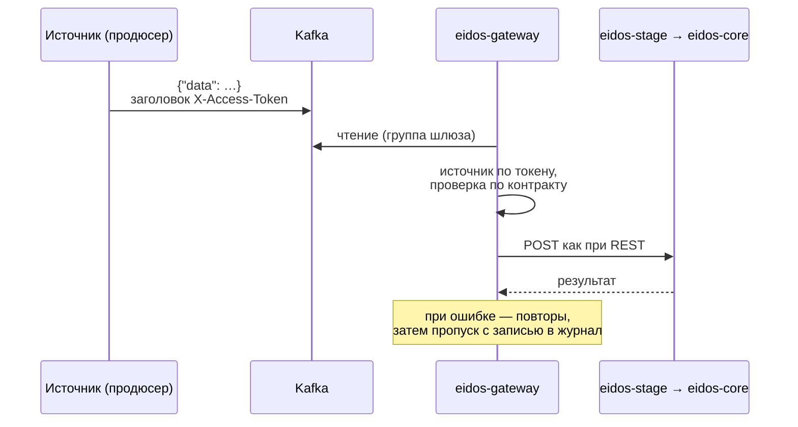

# Передача через Kafka

Через Kafka удобно передавать большие объёмы и поток изменений: источник пишет
сообщения в топик, шлюз читает их и проводит каждое через тот же путь, что и
REST-запрос. Ответа отправителю нет.

## Как это устроено

- Шлюз держит **одного потребителя на тип сущности**: топик для физлиц и топик
  для юрлиц. Тип определяется топиком, а не содержимым сообщения.
- Топик **общий для всех источников**: каждое сообщение несёт токен своего
  источника в заголовке.
- Настройки потребителя — брокер, топик, группа — хранятся в базе шлюза и
  меняются без перезапуска сервиса.
- Если ни одна настройка не включена, шлюз работает только по REST.



## Настройка на стороне платформы

### В консоли

**Kafka шлюза**: адрес брокеров, топик, группа потребителя, переключатель
«Консьюмер включён». Экран настраивает только канал физлиц. См.
[Kafka шлюза](../console/kafka.md).

### Через API

```bash
curl -s -X PUT http://<gateway>:8090/internal/api/v1/kafka-config \
  -H "X-Admin-Token: $ADMIN_TOKEN" -H "Content-Type: application/json" \
  -d '{"entityType":"LEGAL_ENTITY","bootstrapServers":"kafka:9092","topic":"legal-data","groupId":"eidos-gateway","enabled":true}'
```

| Поле | Описание |
|---|---|
| `entityType` | `PERSON` (по умолчанию) или `LEGAL_ENTITY` |
| `bootstrapServers` | Адреса брокеров через запятую — так, как их видит контейнер шлюза |
| `topic` | Топик для этого типа сущности |
| `groupId` | Группа потребителя шлюза |
| `enabled` | Включён ли потребитель |

После сохранения шлюз сразу перезапускает потребителей. Новая группа читает
топик **с самого начала** (`auto.offset.reset=earliest`). Справочник —
[API eidos-gateway](../reference/api/gateway-admin.md).

!!! warning "Только брокер без аутентификации"
    Настройки потребителя ограничены адресом, топиком и группой: TLS и SASL
    в текущей версии не настраиваются. Подключаться можно к брокеру, который
    принимает соединения без аутентификации, — держите его во внутренней сети.

На стенде брокер Redpanda доступен контейнерам как `kafka:9092`, с хоста —
`localhost:19092`. Топики создаются при первой записи.

## Требования к сообщению

| Часть | Требование |
|---|---|
| Значение | JSON-объект `{"data": {…}}` в UTF-8, как тело REST-запроса |
| Заголовок `X-Access-Token` | Токен источника, байты строки в UTF-8 |
| Ключ | Платформой не используется. Рекомендуем идентификатор клиента в источнике: изменения одного клиента попадут в одну партицию |
| Поле `source` в значении | Не нужно, заменяется кодом источника из токена |

## Примеры отправки

=== "rpk (стенд)"

    ```bash
    docker compose exec -T kafka rpk topic produce client-data \
      -k CRM-000123 -H "X-Access-Token:$DEMO_CRM_TOKEN" < card-oneline.json
    ```

    `rpk` отправляет каждую строку файла как отдельное сообщение — сохраните
    карточку в одну строку.

=== "kcat"

    ```bash
    kcat -P -b localhost:19092 -t client-data \
      -k CRM-000123 -H "X-Access-Token=$DEMO_CRM_TOKEN" card-oneline.json
    ```

=== "Python"

    ```python
    import json
    from confluent_kafka import Producer

    producer = Producer({"bootstrap.servers": "localhost:19092"})
    producer.produce(
        "client-data",
        key=card["client_id"],
        value=json.dumps({"data": card}, ensure_ascii=False).encode("utf-8"),
        headers=[("X-Access-Token", EIDOS_TOKEN.encode("utf-8"))],
    )
    producer.flush()
    ```

=== "Java"

    ```java
    ProducerRecord<String, String> record = new ProducerRecord<>(
            "client-data", clientId, "{\"data\":" + cardJson + "}");
    record.headers().add("X-Access-Token", token.getBytes(StandardCharsets.UTF_8));
    producer.send(record);
    ```

Готовый генератор тестовых сообщений — `loadtest/produce.py` и
`loadtest/loadtest.py --mode kafka` в репозитории `eidos-infrastructure`.

## Что происходит с ошибочными сообщениями

Сообщение проходит те же проверки, что REST-запрос: токен, контракт, данные,
преобразование, ядро. Если любая проверка не прошла:

1. шлюз пишет в журнал `Skipping Kafka message <топик>-<партиция>@<смещение>: <причина>`;
2. сообщение повторяется несколько раз подряд, без паузы;
3. после исчерпания попыток сообщение пропускается, смещение фиксируется.

Очереди недоставленных сообщений нет, и источник об отказе не узнаёт. Поэтому:

- **проверяйте контракт на тестовых данных по REST** до запуска потока —
  REST возвращает причину отказа;
- **следите за счётчиком отклонённых** на дашборде. Каждая попытка обработать
  ошибочное сообщение увеличивает счётчик, поэтому одно такое сообщение даёт
  несколько отклонений;
- **ищите причины в журнале шлюза**:
  `docker compose logs eidos-gateway | grep "Skipping Kafka message"`.

Если недоступна сама платформа (`eidos-stage` или ядро не отвечают), сообщения
тоже пропускаются после повторов. Перед работами на платформе выключайте
потребителя и включайте его после: непрочитанные сообщения останутся в топике.

## Производительность

Каждый потребитель обрабатывает сообщения **последовательно в одном потоке**:
следующее сообщение берётся после того, как ядро сохранило предыдущее. Число
партиций топика на скорость не влияет. Если нужна большая пропускная
способность, используйте REST с параллельными запросами. См.
[Производительность](../operations/performance.md).
