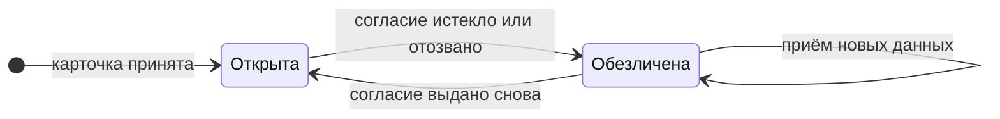
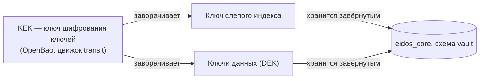

# Защита персональных данных

Платформа хранит персональные данные: ФИО, ПИНФЛ, паспорт, телефон, адреса.
Пока клиент согласен на обработку, они хранятся открыто. Как только согласие
заканчивается, ядро заменяет их токенами: значения уезжают в зашифрованное
хранилище, а в карточке остаются ссылки.

## Что действует

| Механизм | Состояние |
|---|---|
| Слепой индекс для сопоставления и поиска по ПИНФЛ | Действует для всех записей физлиц |
| Хранение ключей через OpenBao, ключ шифрования ключей не покидает хранилище | Действует |
| Хранилище токенов и конвертное шифрование значений | Действует |
| Обезличивание записей клиентов без согласия | Действует для физлиц |
| Раскрытие по запросу с основанием и журналом | Действует |

!!! warning "Охват обезличивания ограничен"
    Токенами заменяются тринадцать полей Золотой записи физлица. Вне охвата
    остаются даты, справочные значения, архив, незавершённые записи, записи
    юрлиц и сырьё в MongoDB — там персональные данные по-прежнему открыты.
    Защищайте базы средствами инфраструктуры: шифрование дисков, сетевая
    изоляция, доступ по ролям. См.
    [Персональные данные](../security/personal-data.md).

## Жизненный цикл записи



Переход в обе стороны запускает событие сервиса согласий: ядро сверяется с ним
и приводит форму хранения в соответствие. Страховочный проход раз в час
подбирает записи, до которых событие не дошло.

## Что происходит при обезличивании

Значение каждого персонального поля уходит в хранилище токенов зашифрованным, а
на его место встаёт токен вида `tok_<32 шестнадцатеричных символа>`.

Обезличиваются тринадцать полей: фамилия, имя, отчество, ПИНФЛ, серия и номер
паспорта, кем выдан, телефон, e-mail, место рождения и четыре адресных поля.

Не обезличиваются:

- **даты** — рождения, выдачи и окончания документа, регистрации: колонки типа
  `date`, замена на токен означала бы смену типа колонки;
- **справочные значения** — пол, гражданство, национальность, страна, область,
  район и их коды: по отдельности человека не определяют, но в совокупности
  остаются квазиидентификаторами.

Что при этом **не** меняется:

- **Слепой индекс** — он посчитан от открытых значений и таким остаётся, иначе
  обезличенная запись перестала бы находиться поиском и сопоставлением.
- **Версия записи и архив** — смена формы хранения не изменение данных клиента,
  в истории версий ей делать нечего.

## Приём данных на обезличенную запись

Источник продолжает присылать карточки, ничего не зная о форме хранения. Ядро
на время слияния раскрывает запись, сливает пришедшее по обычным правилам и
обезличивает снова — всё в одной транзакции приёма, поэтому при сбое на любом
шаге запись останется обезличенной.

Без раскрытия слияние сравнивало бы присланное значение с токеном: совпадений
не было бы никогда, и происхождение переписывалось бы при каждом пуше.

## Раскрытие по запросу

Обезличенное значение можно увидеть — это исключение, и оно оставляет след.

```
POST /api/v1/internal/golden-records/{clientId}/reveal
{"fields": ["grPinfl"], "actor": "operator@company", "reason": "основание"}
```

Требования: указан запрашивающий, основание не короче десяти символов. Каждое
раскрытое поле попадает отдельной строкой в журнал `vault.pd_disclosure` вместе
с тем, кто и на каком основании его увидел. Запись при этом **остаётся
обезличенной**: это разовый просмотр, а не смена формы хранения. Вернуть данные
в открытый вид может только возвращённое согласие.

У ядра нет модели ролей — его внутренний API закрыт на периметре. Проверка
права на раскрытие живёт там, где известна личность оператора.

## Слепой индекс

Слепой индекс — это HMAC-SHA256 от комбинации полей с секретным ключом. Он
позволяет проверять равенство, не сравнивая сами значения: одинаковые
комбинации дают одинаковый индекс, а восстановить значения по индексу без
ключа нельзя.

Ядро считает три индекса для каждой записи физлица:

| Индекс | Комбинация | Применение |
|---|---|---|
| `pd_bi_identity` | фамилия + имя + дата рождения + ПИНФЛ | Основное сопоставление, точный поиск по ПИНФЛ |
| `pd_bi_identity_doc` | фамилия + имя + дата рождения + паспорт | Запасное сопоставление, точный поиск по паспорту |
| `pd_bi_pinfl` | ПИНФЛ | Структурный поиск по ПИНФЛ |

Свойства:

- **Тот же результат, что прямое сравнение.** Значения берутся как есть, без
  нормализации, — правила сопоставления не меняются.
- **Индекс считается для всех записей** независимо от согласия, иначе поиск
  находил бы записи то с ним, то без него.
- **Пересчёт при каждом сохранении** записи.
- **Досчёт при старте.** Записи без индекса или с индексом от старого ключа
  ядро пересчитывает пачками при запуске. Досчёт идемпотентен и
  возобновляется после обрыва.
- **Ключ версионируется.** Номер версии ключа хранится рядом с индексом; этот
  же механизм пересчёта рассчитан на будущую ротацию ключа.

Следствие: ПИНФЛ в структурном поиске сопоставляется только целиком —
поиск по части номера невозможен.

## Ключи и OpenBao

Ключи устроены конвертно:



- **KEK** живёт в OpenBao и не покидает его. Ядро передаёт хранилищу ключ и
  получает его зашифрованным (`transit/encrypt`) или расшифрованным
  (`transit/decrypt`).
- **Ключ слепого индекса** генерируется ядром при первом обращении (Google
  Tink), заворачивается KEK и хранится в таблице `vault.pd_blind_index_key`.
  В памяти ядра ключ хранится в расшифрованном виде, пока работает процесс: так
  слепой индекс не требует обращения к хранилищу на каждую карточку.
- **При старте** ядро создаёт в OpenBao движок transit и KEK, если их нет.

!!! danger "Потеря KEK делает данные нечитаемыми"
    Без KEK ядро не расшифрует ключ слепого индекса: сопоставление и поиск
    перестанут работать. Когда подключат токенизацию, без KEK нельзя будет
    расшифровать и сами значения. Резервное копирование OpenBao так же важно,
    как резервное копирование базы. См. [OpenBao](../operations/openbao.md) и
    [Резервное копирование](../operations/backup.md).

## Хранилище токенов (подготовлено)

Для обезличивания в ядре есть хранилище токенов в схеме `vault`:

- на каждого клиента и прогон заводится ключ данных (DEK, AES-256-GCM),
  завёрнутый KEK (`vault.pd_dek`);
- значение поля шифруется ключом данных и заменяется непрозрачным токеном вида
  `tok_<32 hex>` (`vault.pd_token`);
- шифротекст привязан к клиенту и полю: перенести его на другое поле или
  другого клиента нельзя — расшифровка не пройдёт;
- раскрыть значение можно только через хранилище и только при доступном KEK.

Хранилище вынесено в отдельную схему, чтобы компрометация основной схемы сама по
себе не давала доступа к значениям. Слепой индекс позволит находить записи и
после замены значений токенами.

## Состояние согласия

Ядро записывает в Золотую запись, действует ли согласие на обработку
персональных данных — см. [Согласия](consents.md). Это опора для обезличивания:
следующий шаг — заменять значения токенами для клиентов без действующего
согласия и раскрывать их при новом согласии.
